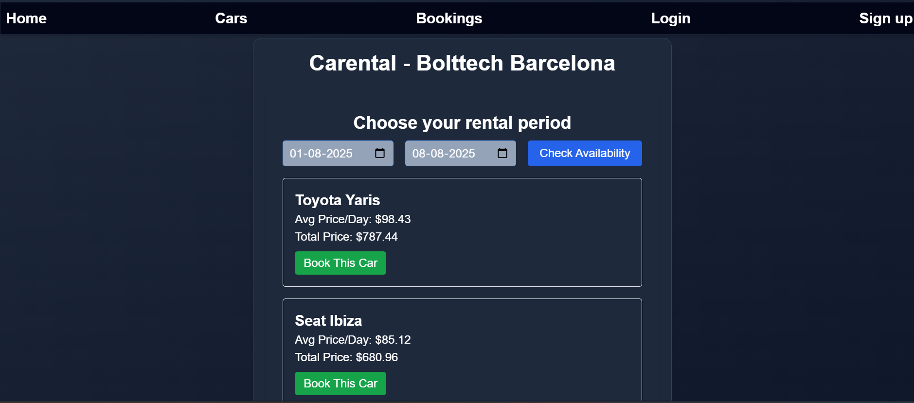
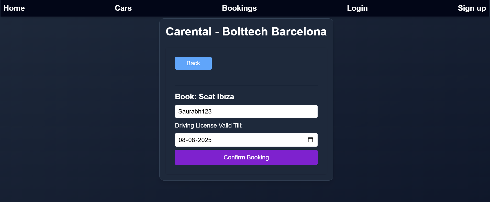
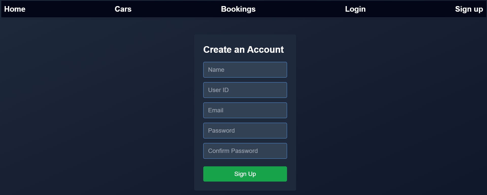
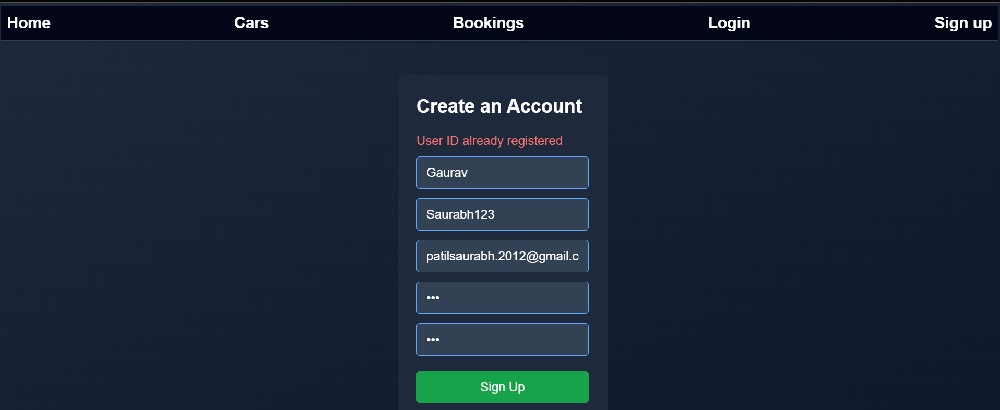
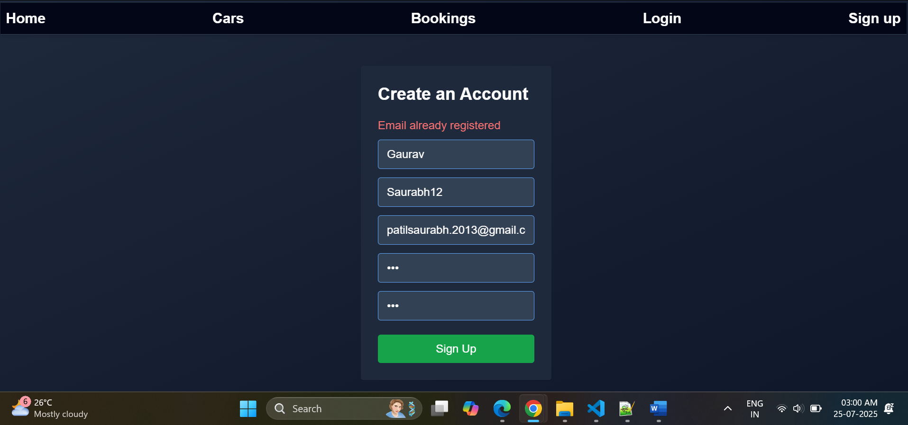
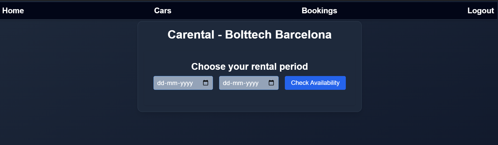

# Car Rental Service

### How to run this project:

- npm i in both ui and server folder
- Copy the .env file shared in email to both server and ui folder
- npm start in both ui and server folder

### Things that are completed:

- User story 1 and 2 are completed but there might still be some bugs in this application.

### Things that are left:

- I haven't written any tests for any of the scenario as of now.

### Points to consider:

- As this is just an MVP, I haven't fully integrated login/authentication for Booking and checking availability. We can check availability and book a car directly without logging in.
- To view the list of cars and bookings, we have to login via some credentials.
- You can sign up for the application or can use my test credentials to login into the application. test login credentials will be shared over the email.

### Steps to check the availability and book the car:

Step 1:

Step 2: Put the from and to dates and click on Check Availability.
Check the car costing and click on Book this Car.

Step 3: UserId will be pre-populated if user is logged in. Fill in the driving license Valid till and then click on confirm Booking. An Alert will come with the message "Booking successful"

### Steps to Sign up:

- Fill up this form - User ID and email ID should be unique.  
  

- Validation Errors:
  

- After successfully signing up, User has to login using his credentials.

### After login screenshot:

